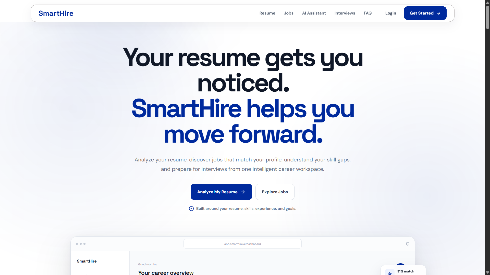
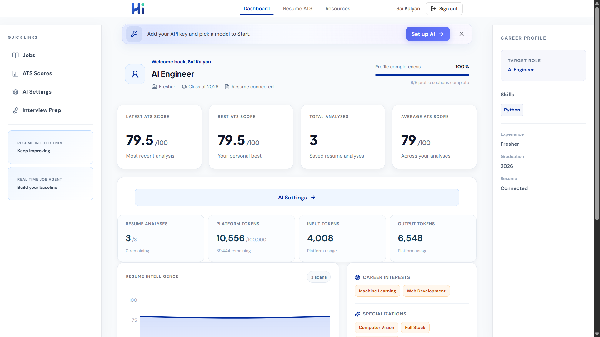
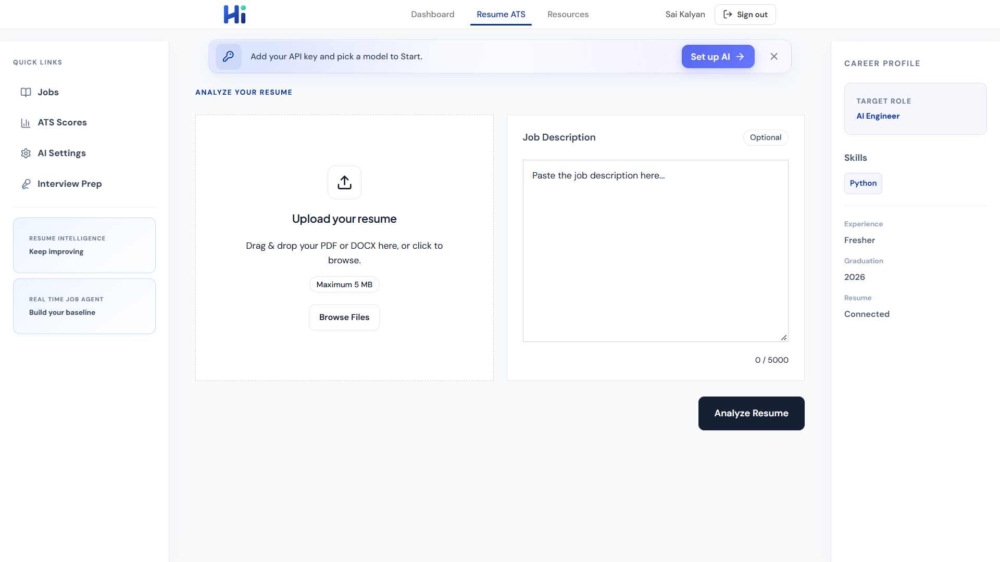
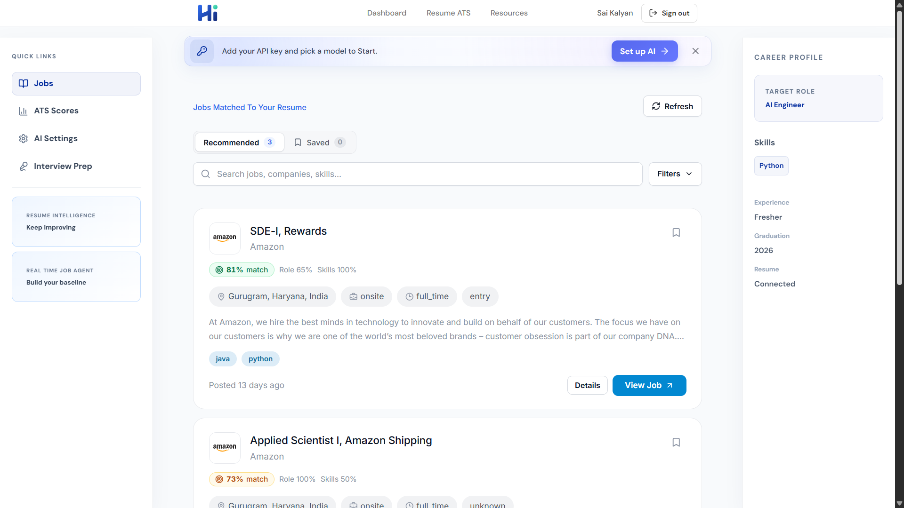
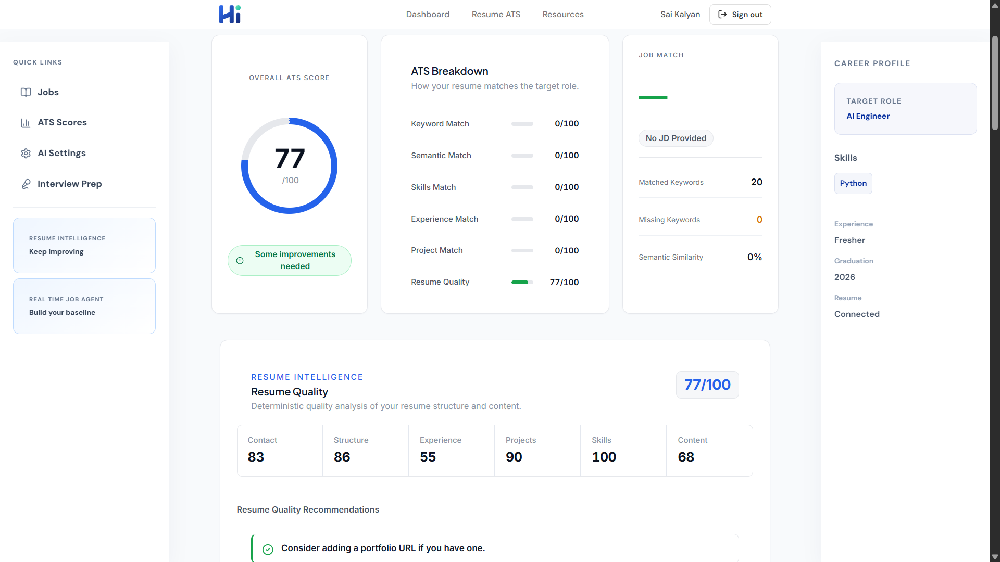
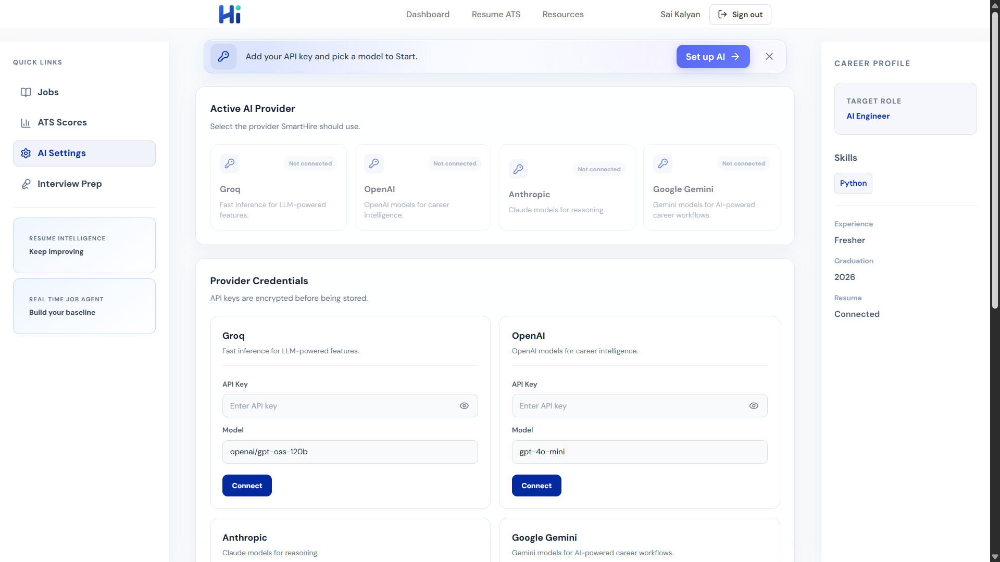
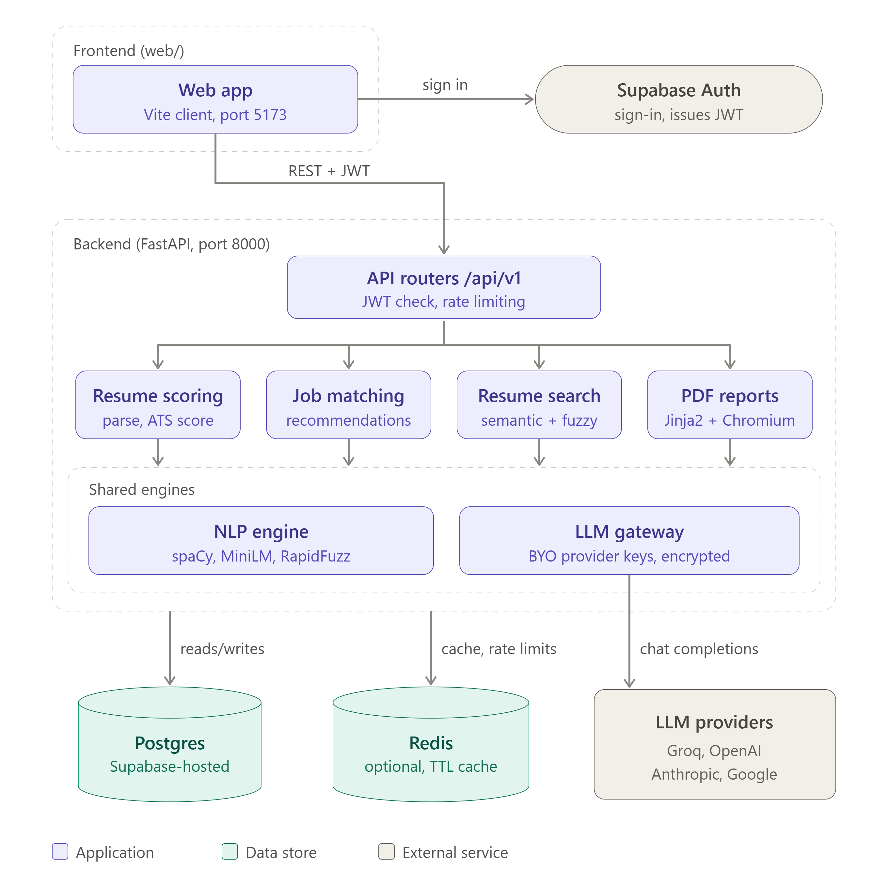

<div align="center">

# SmartHire

**An AI-powered Applicant Tracking System that analyzes resumes against job descriptions, evaluates resume quality, validates skills, and generates actionable ATS scores.**

[](https://your-vercel-domain.vercel.app/)
[](https://github.com/KalyanSai956/SmartHire)




</div>

---

## Table of Contents

- [Overview](#overview)
- [Live Demo](#live-demo)
- [Screenshots](#screenshots)
- [Key Features](#key-features)
- [Architecture](#architecture)
- [Tech Stack](#tech-stack)
- [Getting Started](#getting-started)
- [Project Structure](#project-structure)

---

## Overview

SmartHire is built for **students, job seekers, and developers** who want to understand how well their resume matches a target role and improve their chances of getting shortlisted.

Instead of relying on simple keyword matching, SmartHire combines **NLP, semantic embeddings, and LLM-based analysis** to score a resume across multiple dimensions and deliver specific, actionable feedback.

---

## Live Demo

| Resource          | Link                                                                    |
| ----------------- | ----------------------------------------------------------------------- |
| Web Application   | [your-vercel-domain.vercel.app](https://your-vercel-domain.vercel.app/) |
| GitHub Repository | [KalyanSai956/SmartHire_ATS](https://github.com/KalyanSai956/SmartHire) |

---

## Screenshots

### Dashboard

<p align="center">
  
</p>

### Resume Analysis

<p align="center">
  
</p>

### Jobs

<p align="center">
  
</p>

### ATS Results

<p align="center">
  
</p>

### AI Gateway

<p align="center">
  
</p>

---

## Key Features

### AI-Powered Resume Analysis

- Resume text extraction and structured profile generation
- Skills, experience, and project analysis
- Resume quality evaluation with detailed feedback

### Advanced ATS Scoring

SmartHire evaluates resumes across multiple dimensions rather than keywords alone.

| Metric                    | Description                                                      |
| ------------------------- | ---------------------------------------------------------------- |
| **Overall ATS Score**     | Combined score across all dimensions                             |
| **Job Description Match** | Overall compatibility with the target role                       |
| **Keyword Match**         | Matched and missing keywords                                     |
| **Semantic Match**        | Meaning-based similarity using embeddings                        |
| **Skills Match**          | Alignment of resume skills with required skills, plus skills gap |
| **Experience Match**      | Relevance of work experience                                     |
| **Project Match**         | Relevance of projects to the role                                |
| **Resume Quality**        | Structure, content, and completeness                             |

### Semantic Resume Matching

Uses NLP and sentence embeddings to understand the relationship between a resume and a job description, identifying relevant experience and skills even when exact keywords are absent.

### Job Description Intelligence

Analyzes job descriptions to extract role information, required skills, preferred skills, job-specific requirements, and resume-to-JD compatibility.

### Resume Quality Engine

Quality is assessed across six categories: **Contact Information, Structure, Experience, Projects, Skills,** and **Content Quality**.

### Skill Validation

Reports validated skills, unvalidated skills, total skills, validated skill count, and an overall validation percentage.

### Detailed Feedback

Actionable guidance on resume content, missing skills and keywords, project relevance, job-description alignment, and overall quality.

### Platform Capabilities

| Capability            | Details                                                  |
| --------------------- | -------------------------------------------------------- |
| **Analysis History**  | Access and manage previously analyzed resumes            |
| **PDF Reports**       | Download resume analysis results as PDF                  |
| **Authentication**    | Supabase-based user authentication with per-user history |
| **BYOK AI Providers** | Bring Your Own Key support for supported LLM providers   |
| **Redis**             | Caching, quota controls, and rate limiting               |
| **Semantic Indexing** | Embedding-based resume indexing as a foundation for RAG  |
| **Docker**            | Run the backend with Docker and Docker Compose           |

---

## Architecture

SmartHire follows a modular full-stack architecture connecting a React/Vite frontend, a FastAPI backend, Supabase services, NLP/AI engines, Redis caching, and external LLM providers.

<p align="center">
  
</p>

### Architecture Flow

```text
React + Vite
     │
     ├── Supabase Authentication ──► JWT
     │
     ▼
FastAPI Backend
     │
     ├── API Routes
     ├── Resume Scoring
     ├── Job Matching
     ├── Resume Search / RAG
     └── PDF Reports
     │
     ├───────────────┬───────────────┐
     ▼               ▼               ▼
 NLP Engine       Supabase         Redis
 spaCy            PostgreSQL       Cache
FastEmbed / ONNX
     │
     ▼
LLM Gateway
     ├── Groq
     ├── OpenAI
     ├── Google
     └── Anthropic
```

---

## Tech Stack

| Layer                   | Technologies                                                   |
| ----------------------- | -------------------------------------------------------------- |
| **Frontend**            | React, Vite, JavaScript, CSS                                   |
| **Backend**             | Python, FastAPI, REST APIs                                     |
| **AI / NLP**            | spaCy, FastEmbed/ONNX, LLM-based analysis, Semantic embeddings |
| **Database & Services** | Supabase, PostgreSQL, Redis                                    |
| **Infrastructure**      | Docker, Docker Compose                                         |

---

## Getting Started

### Prerequisites

- Node.js 18+
- Python 3.11+
- Docker and Docker Compose (optional)
- A Supabase project and a Redis instance

### 1. Clone the repository

```bash
git clone https://github.com/KalyanSai956/SmartHire.git
cd SmartHire
```

### 2. Run the backend

```bash
# With Docker
docker compose up --build

# Or locally
cd backend
pip install -r requirements.txt
uvicorn main:app --reload
```

### 3. Run the frontend

```bash
cd web
npm install
npm run dev
```

---

## Project Structure

```text
SmartHire/
├── web/        # React + Vite application
├── backend/         # FastAPI application
├── screenshots/     # README images
├── docker-compose.yml
└── README.md
```

---

<div align="center">

**Built by [P Sai Kalyan](https://github.com/KalyanSai956)**

If you find this project useful, consider giving it a ⭐

</div>
